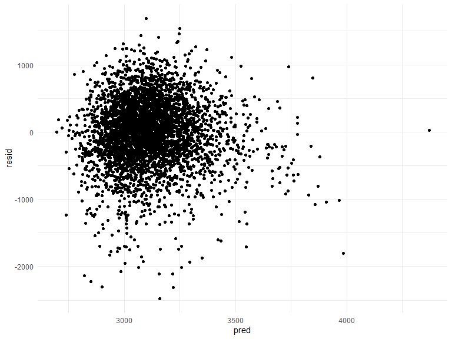
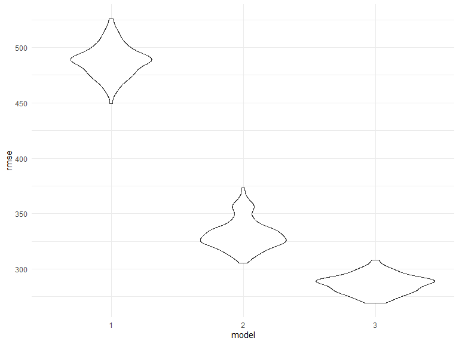
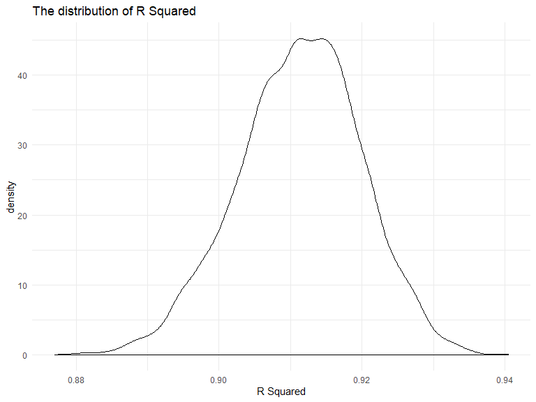
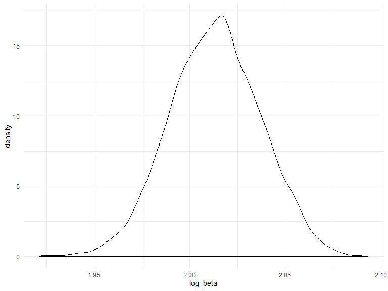

p8105\_hw6\_yx2507
================
Yuqing Xue
11/22/2019

``` r
library(tidyverse)
library(purrr)
library(modelr)
library(mgcv)
knitr::opts_chunk$set(
    echo = TRUE,
    warning = FALSE,
    fig.width = 8, 
  fig.height = 6,
  out.width = "90%"
)
options(
  ggplot2.continuous.colour = "viridis",
  ggplot2.continuous.fill = "viridis"
)
scale_colour_discrete = scale_colour_viridis_d
scale_fill_discrete = scale_fill_viridis_d
theme_set(theme_minimal() + theme(legend.position = "bottom"))
set.seed(1)
```

# Problem 1

## 1.1 Load and clean the data

``` r
bw_df=read_csv(file = "./data/birthweight.csv")%>%
  janitor::clean_names()%>%
  mutate(
    babysex = fct_infreq(as.factor(babysex)),
    frace = fct_infreq(as.factor(frace)),
    malform = fct_infreq(as.factor(malform)),
    mrace = fct_infreq(as.factor(mrace))
  )
```

    ## Parsed with column specification:
    ## cols(
    ##   .default = col_double()
    ## )

    ## See spec(...) for full column specifications.

``` r
# check missing data
missing= bw_df %>%
   summarise_all((funs(sum(is.na(.))))) 
missing
```

    ## # A tibble: 1 x 20
    ##   babysex bhead blength   bwt delwt fincome frace gaweeks malform menarche
    ##     <int> <int>   <int> <int> <int>   <int> <int>   <int>   <int>    <int>
    ## 1       0     0       0     0     0       0     0       0       0        0
    ## # ... with 10 more variables: mheight <int>, momage <int>, mrace <int>,
    ## #   parity <int>, pnumlbw <int>, pnumsga <int>, ppbmi <int>, ppwt <int>,
    ## #   smoken <int>, wtgain <int>

After cleaning the data, we check the missing data and make sure that
there is no missing data.

## 1.2 Model fitting

I hypothesize that baby’s birthweight is associated with mother’s
characteristics weight at delivery due to the literature review. The
research hypothesis would be the larger for mother’s weight at delivery,
the larger the birthweight for the baby. I will first check the
scatterplot to see whether there is a linear trend and then fit a linear
regression model for this.

## 1.3 Check linearity

``` r
bw_df%>%
  ggplot(aes(x=delwt, y=bwt))+
  geom_point()
```


As we can see from the scatterplot, there is a moderate postivie linear
relationship between mother’s weight at delivery and birthweight.

## 1.4 Fit a simple linear regression model

``` r
fit = lm(bwt ~ delwt+ momage, data = bw_df)
```

## 1.5 Tidy the result

``` r
fit %>% 
  broom::tidy() %>% 
  as.tibble()
```

    ## # A tibble: 3 x 5
    ##   term        estimate std.error statistic   p.value
    ##   <chr>          <dbl>     <dbl>     <dbl>     <dbl>
    ## 1 (Intercept)  1868.      60.3       31.0  2.97e-190
    ## 2 delwt           6.44     0.334     19.3  1.04e- 79
    ## 3 momage         15.2      1.91       7.95 2.33e- 15

## 1.6 Model diagnosis

``` r
diagnosis= bw_df%>%
     modelr::add_residuals(fit)%>%
      modelr::add_predictions(fit)

diagnosis_plot=diagnosis%>% 
  ggplot(aes(x= pred, y= resid))+
  geom_point()

diagnosis_plot
```



From this diagnosis plot, we can see the residuals are almost randomly
distributed around 0. There is no extrem pattern observed. This supports
the assumptions.

## 1.7 Fit more models for comparison

``` r
fit_2=lm(bwt ~ blength + gaweeks, data = bw_df)

fit_2%>%
  broom::tidy() %>% 
  as.tibble()
```

    ## # A tibble: 3 x 5
    ##   term        estimate std.error statistic  p.value
    ##   <chr>          <dbl>     <dbl>     <dbl>    <dbl>
    ## 1 (Intercept)  -4348.      98.0      -44.4 0.      
    ## 2 blength        129.       1.99      64.6 0.      
    ## 3 gaweeks         27.0      1.72      15.7 2.36e-54

``` r
fit_3= lm(bwt ~ bhead + blength + babysex + bhead*blength+bhead*babysex+blength*babysex+ bhead*blength*babysex, data = bw_df)
```

## 1.8 Compare the models

``` r
cv_df= crossv_mc (bw_df, 100)

cv_df =
  cv_df %>% 
  mutate(
    train = map(train, as_tibble),
    test = map(test, as_tibble))


cv=cv_df%>%
  mutate(fit= map(train,~fit),
         fit_2= map(train,~fit_2),
         fit_3= map(train,~fit_3)
         )%>%
  mutate(rmse_1 = map2_dbl(fit, test, ~rmse(model = .x, data = .y)),
         rmse_2 = map2_dbl(fit_2, test, ~rmse(model = .x, data = .y)),
         rmse_3 = map2_dbl(fit_3, test, ~rmse(model = .x, data = .y)))
```

``` r
plot= cv%>% 
  select(starts_with("rmse")) %>% 
  pivot_longer(
    everything(),
    names_to = "model", 
    values_to = "rmse",
    names_prefix = "rmse_") %>% 
  mutate(model = fct_inorder(model)) %>% 
  ggplot(aes(x = model, y = rmse)) + geom_violin()

plot
```



From the figure, we can tell that model 1 has obviously larger rmse,
which means it might not be an appropriate model. Model 1 might lose
some important information. Model 3 has smaller rmse than the other 2,
it might be a better model.

# Promble 2

## 2.1 Read in the data

``` r
weather_df = 
  rnoaa::meteo_pull_monitors(
    c("USW00094728"),
    var = c("PRCP", "TMIN", "TMAX"), 
    date_min = "2017-01-01",
    date_max = "2017-12-31") %>%
  mutate(
    name = recode(id, USW00094728 = "CentralPark_NY"),
    tmin = tmin / 10,
    tmax = tmax / 10) %>%
  select(name, id, everything())
```

    ## Registered S3 method overwritten by 'crul':
    ##   method                 from
    ##   as.character.form_file httr

    ## Registered S3 method overwritten by 'hoardr':
    ##   method           from
    ##   print.cache_info httr

    ## file path:          C:\Users\lenovo\AppData\Local\rnoaa\rnoaa\Cache/ghcnd/USW00094728.dly

    ## file last updated:  2019-10-15 11:02:59

    ## file min/max dates: 1869-01-01 / 2019-10-31

## 2.2 Doing bootstraping

``` r
weather=weather_df%>%
  modelr::bootstrap(n= 5000)%>%
  mutate(
    models= map(strap, ~lm(tmax~ tmin, data = .x)),
    results =  map(models, broom::tidy),
    r_square = map(models, broom::glance)
  )%>%
  select(-models, -strap)%>%
  unnest(results, r_square)%>%
  janitor::clean_names()
```

## 2.3 Estimate1– r^2

``` r
weather %>%
  ggplot(aes(x = r_squared)) +
  geom_density() +
labs(title = "The distribution of R Squared",
       x = "R Squared")
```



``` r
quantile(pull(weather, r_squared),c(0.025,0.975))
```

    ##      2.5%     97.5% 
    ## 0.8936977 0.9274807

the figure above shows the distribution of r^2 in the bootstrap dataset
tend to be a normal distribution, we can see the 95% confidence interval
is (0.8936977, 0.9274955 )

## 2.4 Estimate–`log(beta0*beta1)`

``` r
log_beta= weather%>%
  select(id, term, estimate)%>%
  pivot_wider(
    names_from = "term",
    values_from = "estimate"
  )%>%
  mutate(intercept=`(Intercept)`,
         log_beta=log(intercept*tmin)
         )

plot_beta=log_beta%>%
  ggplot(aes(x=log_beta))+geom_density()

plot_beta
```



``` r
quantile(pull(log_beta, log_beta),c(0.025,0.975))
```

    ##     2.5%    97.5% 
    ## 1.966942 2.058528

we can see from the plot above, we can tell that the distribution of the
`log(beta0*beta1)` is approximately normal distribution. This indicates
that bootstrap sampling method is similar to drawing sample from the
population and fitting model with that samples. This will result in the
parameter estimates from the regression model tend to follow normal
distribution.

The 95% confidence interval for the `log(beta0*beta1)` is (1.966942,
2.058555)
