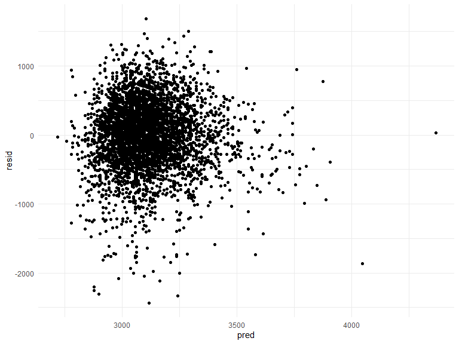
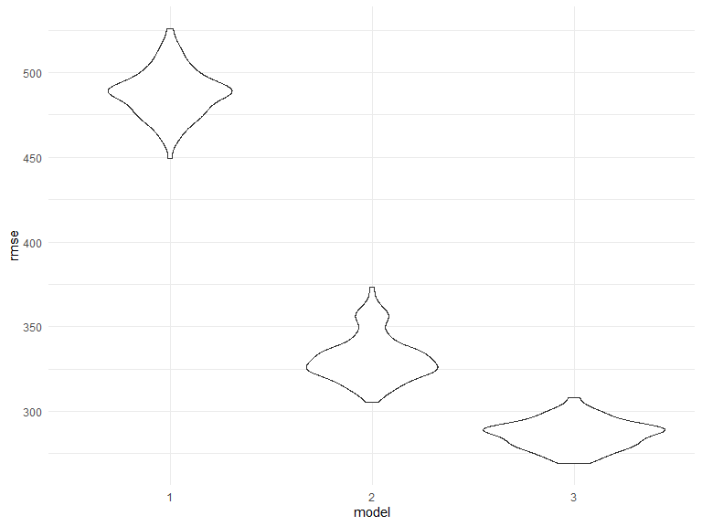

p8105\_hw6\_yx2507
================
Yuqing Xue
11/22/2019

``` r
library(tidyverse)
library(purrr)
library(modelr)
library(mgcv)
knitr::opts_chunk$set(
    echo = TRUE,
    warning = FALSE,
    fig.width = 8, 
  fig.height = 6,
  out.width = "90%"
)
options(
  ggplot2.continuous.colour = "viridis",
  ggplot2.continuous.fill = "viridis"
)
scale_colour_discrete = scale_colour_viridis_d
scale_fill_discrete = scale_fill_viridis_d
theme_set(theme_minimal() + theme(legend.position = "bottom"))
set.seed(1)
```

# problem 1

## load and clean the data

``` r
bw_df=read_csv(file = "./data/birthweight.csv")%>%
  janitor::clean_names()%>%
  mutate(
    babysex = fct_infreq(as.factor(babysex)),
    frace = fct_infreq(as.factor(frace)),
    malform = fct_infreq(as.factor(malform)),
    mrace = fct_infreq(as.factor(mrace))
  )
```

    ## Parsed with column specification:
    ## cols(
    ##   .default = col_double()
    ## )

    ## See spec(...) for full column specifications.

``` r
# check missing data
missing= bw_df %>%
   summarise_all((funs(sum(is.na(.))))) 
missing
```

    ## # A tibble: 1 x 20
    ##   babysex bhead blength   bwt delwt fincome frace gaweeks malform menarche
    ##     <int> <int>   <int> <int> <int>   <int> <int>   <int>   <int>    <int>
    ## 1       0     0       0     0     0       0     0       0       0        0
    ## # ... with 10 more variables: mheight <int>, momage <int>, mrace <int>,
    ## #   parity <int>, pnumlbw <int>, pnumsga <int>, ppbmi <int>, ppwt <int>,
    ## #   smoken <int>, wtgain <int>

after cleaning the data, we check the missing data and make sure that
there is no missing data.

# model fitting"

I hypothesize that baby’s birthweight is associated with mother’s
characteristics like age and weight at delivery. The research hypothesis
would be the larger for mother’s weight at delivery, the larger the
birthweight for the baby. I will fit a linear regression model for this.

``` r
fit = lm(bwt ~ delwt+ momage, data = bw_df)
```

tidy the result

``` r
fit %>% 
  broom::tidy() %>% 
  as.tibble()
```

    ## # A tibble: 3 x 5
    ##   term        estimate std.error statistic   p.value
    ##   <chr>          <dbl>     <dbl>     <dbl>     <dbl>
    ## 1 (Intercept)  1868.      60.3       31.0  2.97e-190
    ## 2 delwt           6.44     0.334     19.3  1.04e- 79
    ## 3 momage         15.2      1.91       7.95 2.33e- 15

# model diagnosis

``` r
diagnosis= bw_df%>%
     modelr::add_residuals(fit)%>%
      modelr::add_predictions(fit)

diagnosis_plot=diagnosis%>% 
  ggplot(aes(x= pred, y= resid))+
  geom_point()

diagnosis_plot
```



# compare with more model

1.One using length at birth and gestational age as predictors (main
effects only)

``` r
fit_2=lm(bwt ~ blength + gaweeks, data = bw_df)

fit_2%>%
  broom::tidy() %>% 
  as.tibble()
```

    ## # A tibble: 3 x 5
    ##   term        estimate std.error statistic  p.value
    ##   <chr>          <dbl>     <dbl>     <dbl>    <dbl>
    ## 1 (Intercept)  -4348.      98.0      -44.4 0.      
    ## 2 blength        129.       1.99      64.6 0.      
    ## 3 gaweeks         27.0      1.72      15.7 2.36e-54

``` r
fit_3= lm(bwt ~ bhead + blength + babysex + bhead*blength+bhead*babysex+blength*babysex+ bhead*blength*babysex, data = bw_df)
```

# compare the models

``` r
cv_df= crossv_mc (bw_df, 100)

cv_df =
  cv_df %>% 
  mutate(
    train = map(train, as_tibble),
    test = map(test, as_tibble))


cv=cv_df%>%
  mutate(fit= map(train,~fit),
         fit_2= map(train,~fit_2),
         fit_3= map(train,~fit_3)
         )%>%
  mutate(rmse_1 = map2_dbl(fit, test, ~rmse(model = .x, data = .y)),
         rmse_2 = map2_dbl(fit_2, test, ~rmse(model = .x, data = .y)),
         rmse_3 = map2_dbl(fit_3, test, ~rmse(model = .x, data = .y)))
```

``` r
plot= cv%>% 
  select(starts_with("rmse")) %>% 
  pivot_longer(
    everything(),
    names_to = "model", 
    values_to = "rmse",
    names_prefix = "rmse_") %>% 
  mutate(model = fct_inorder(model)) %>% 
  ggplot(aes(x = model, y = rmse)) + geom_violin()

plot
```


